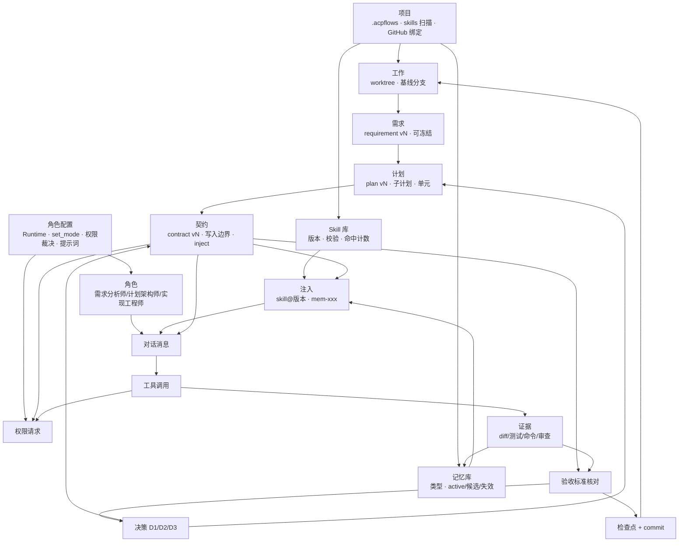

# 设计稿里的引用关系

> 2026-08-08。每条引用都标了**设计稿原文依据**——不是推测。
> 里程碑按这张图的拓扑序排，见末尾。

---

## 图

---

## 逐条依据

| 引用 | 设计稿原文 |
|---|---|
| 项目 → 工作 | 「创建项目**不会开始任何工作**；之后在项目下『＋ 新建对话』才会切 worktree」 |
| 项目 → Skill 库 | 创建项目弹层：「发现已有 Skill 目录 · 2」，扫描 `**/skills`，产出 `.acpflows/skills/` |
| 项目 → 记忆 | 创建项目弹层：将创建 `acp-engine/.acpflows/`（skills/ · **memory/** · project.yaml） |
| 项目 → GitHub | 创建项目弹层：`remote git@github.com:…` → 账号 `wyy-work`，「管理账号 ↗」 |
| 工作 → worktree | 新建工作弹层：将创建分支 `duet/work-09`、路径 `~/.duet/worktrees/…`、基线 `main @ 7c1de90` |
| 工作 → 需求 | 消息流第一条：`Claude · 需求分析师` `requirement v2` `已冻结` |
| 需求 → 计划 | `Claude · 计划架构师` `plan v5` `3 子计划` `7 单元`；契约里 `based_on_plan_version: 5` |
| 计划 → 契约 | 契约 YAML：`unit_id: unit-012` `subplan_id:` `contract_version: 3` |
| 契约 → 注入 | 契约 YAML 里有 `inject:` 段 |
| 契约 → 权限 | 权限卡片：「**写入边界外**」——边界来自契约的 `allowed_changes` / `forbidden_changes` |
| 契约 → 验收标准 | 弹层：契约下面直接跟「验收标准」+ 证据 |
| 角色 → 消息 | 每条消息的标签：`Claude · 需求分析师` / `Claude · 计划架构师` / `Codex · 实现工程师` |
| 注入 → 消息 | 消息里那行：`注入 skill:rust-test-first@2.1 · mem-203 · mem-188` |
| 工具调用 → 证据 | 「证据四类：Git diff · 测试输出 · 命令记录 · 审查意见 —— **由应用直接采集，非 Agent 转述**」 |
| 证据 → 验收标准 | `✓ ev-441` `✓ ev-440` `○ 无证据` 逐条挂在验收标准下 |
| 验收标准 → 决策 | D2 弹层里三个选项都基于「契约 + 证据 + 审查意见」 |
| 决策 → 契约/计划 | 「决定会写入 Decision 记录并**生成新的契约版本**」；选项 C「创建 plan v6」 |
| 验收 → 检查点 | `a1c9f30 2 分钟前 · **验收后自动提交**`；契约「冻结于 **ck-07**」 |
| 检查点 → 工作 | 右栏「本次工作的 commit · 3」，标「仅本地」 |
| 项目 → Skill 库 | Skill 页范围选择器：`acp-engine 4 Skill · 12 记忆`；**还有一个全局 `~/.acpflows · 9`** |
| 项目 → 记忆库 | 记忆页范围选择器：`acp-engine 12 条`；**还有跨项目 `~/.acpflows · 5`** |
| 角色配置 → 角色 | 角色页表格：每个角色绑定 `Runtime` + `会话模式 set_mode` + `提示词` |
| **角色配置 → 权限裁决** | 角色页有一列就叫「权限裁决」（`逐条询问 ⌄`）——★ 我把策略做在了会话层，**设计稿是按角色配的** |
| Skill → 注入 | 对话里：`注入 skill:rust-test-first@2.1`——**带版本号** |
| 记忆 → 注入 | 对话里：`注入 … mem-203 · mem-188` |
| **证据 → 记忆** | 对话里：「记忆候选：取消需两段（先 cancel，再等 stopReason）· **审核**」——干活过程中产出记忆候选，人审核后进库 |

---

## 拓扑序 → 里程碑该怎么排

按上图的层级，**每一层做完才能做下一层**：

| 层 | 内容 | 为什么不能提前 |
|---|---|---|
| **L1** | 项目（`.acpflows` · skills 扫描 · GitHub 绑定） | 没有项目就没有 skills 库与记忆的存放处 |
| **L2** | 工作（基线分支 · worktree） | 没有 worktree，AI 无处干活 |
| **L3** | 需求（冻结） | 没有冻结的需求，计划无从产出 |
| **L4** | 计划（版本 · 子计划 · 单元） | 契约要引用 `based_on_plan_version` 与 `unit_id` |
| **L5** | 契约（冻结 · 写入边界 · inject） | 权限判断要用它的边界；注入清单在它里面 |
| **L0** | **角色配置**（Runtime 绑定 · set_mode · **权限裁决** · 提示词） | 没有角色，AI 不知道自己是谁、用哪个 Runtime、怎么裁权限 |
| **L6** | 角色 + 注入（Skill@版本 + 记忆） | 每条消息的身份与上下文来源 |
| **L7** | 对话 + 工具调用 + 权限 | ← **我从这一层开始做的** |
| **L8** | 证据采集（四类） | 要有工具调用才有东西可采 |
| **L9** | 验收标准核对 | 要有证据才能核对 |
| **L10** | 决策 D1/D2/D3 | 要有核对结论才谈得上决策 |
| **L11** | 检查点 + commit | 验收通过才提交 |

★ 我实际的做法是 **L7 → L2（部分）→ L1（部分）**，正好倒过来。
所以对话页做出来是个「聊天框」——它上面那六层全是空的。

★★ **`L0` 角色配置比 `L1` 项目还靠前**，而我完全没做：

- 设计稿里**权限裁决是按角色配的**（角色页有一列「权限裁决 `逐条询问 ⌄`」），
  我却把三种策略做在了会话层（`session.Policy`）——**层放错了**
- 每条消息的 `Claude · 需求分析师` / `Codex · 实现工程师` 来自角色配置，
  没有它，消息就没有身份，只能是一条无主的文字
- 角色还绑定 `会话模式 set_mode`——那是 ACP 的收权手段，
  与「实现工程师用 codex、审查员用 claude」这件事是同一个配置

★ **记忆是双向的**：注入进对话（`mem-203`），也从对话里产出候选
（「记忆候选：… · 审核」）。只做「注入」不做「产出候选」的话，
记忆库永远是空的——而那正是这个产品「越用越懂你的项目」的来源。
